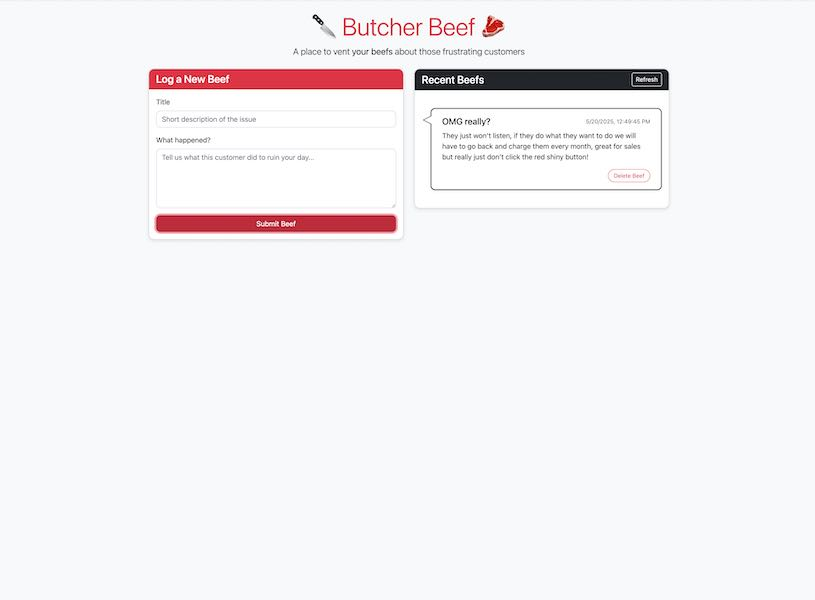

# 🔪 BUTCHER BEEF 🥩




> *"Where customer frustrations get chopped into little pieces!"*

## 🤬 What The Heck Is This Thing?!?

Have you EVER been so TICKED OFF at a customer that you wanted to scream into the void? Well, SCREAM NO MORE, my friend! **BUTCHER BEEF** is your digital punching bag for all those customer-related grievances that make you want to flip tables!

This web app lets you vent your deepest, darkest customer service NIGHTMARES in a safe space where nobody gets hurt (except maybe your keyboard from aggressive typing). Log your beefs, view your beefs, delete your beefs - it's therapeutic meat processing for your SOUL!

## ✨ Super Amazing Features That Will Blow Your Mind

- 🥊 **Beef Logger 3000**: Type out your customer frustrations in a soothing form interface
- 💬 **Speech Bubble Technology**: Your complaints appear in fancy speech bubbles like REAL ANGRY THOUGHTS
- 🗑️ **Rage Delete™**: Obliterate complaints from existence when you're feeling better
- 🔄 **Refresh Button**: For when you need to relive the trauma over and over again
- 💾 **Permanent Record**: Your beefs are saved forever (or until you delete them)

## 🛠️ Tech Stack of AWESOMENESS

- **Frontend**: HTML + CSS + JavaScript with Bootstrap 5 (because we're FANCY)
- **Backend**: Node.js + Express (the dynamic duo of web development)
- **Database**: A super sophisticated JSON file (we're keeping it old school)
- **Deployment**: Your computer! It's local, it's secure, it's.... localhost!

## 🚀 How To Make This Baby FLY!

### Prerequisites

- Node.js (if you don't have this, what have you been DOING with your life?!)
- A burning desire to complain about customers
- Fingers capable of aggressive typing

### Installation

1. Clone this beast of a repo:
   ```bash
   git clone https://github.com/motionbug/butcher-beef.git
   ```

2. Teleport to the project folder:
   ```bash
   cd butcher-beef
   ```

3. Summon the dependencies:
   ```bash
   npm install
   ```
   (Then wait while npm does its thing... maybe grab a snack or something)

4. UNLEASH THE BEAST:
   ```bash
   npm start
   ```

5. Point your browser to `http://localhost:3000` and LET THE BEEF BUTCHERING BEGIN!

## 💻 Development Mode (for the super nerdy folks)

If you want the server to auto-restart when you make changes (BECAUSE WHO HAS TIME TO RESTART MANUALLY?!):

```bash
npm run dev
```

## 📝 How to USE This Magical Creation

1. **Submit a Beef**:
   - Enter a title for your beef (keep it spicy! 🌶️)
   - Pour your heart out in the description
   - SMASH that "Submit Beef" button!

2. **View Your Beef Collection**:
   - Marvel at your growing collection of customer service nightmares
   - Each beef appears in its own speech bubble (fancy!)

3. **Delete a Beef**:
   - Found inner peace? Forgiven that customer?
   - Hit that "Delete Beef" button and watch your troubles disappear!

## ⚠️ DISCLAIMER

This app does not actually process real meat. All beef is digital and no cows were harmed in the making of this application. Your mental health, however, might greatly improve!

## 🧠 Philosophy

> "To beef, or not to beef? That is never the question. The question is: how SPICY will this beef be?" - William Steakspeare 🥩

## 🤝 Contribute

Feel like this app needs more features? Want to make it even MORE ridiculous? Fork it, change it, go wild! After all, the world needs more ways to complain about customers safely!

---

*Built with ❤️ and a lot of repressed customer trauma*

*Copyright (c) 2025 The Butcher Beef Team - All beefs reserved.*
